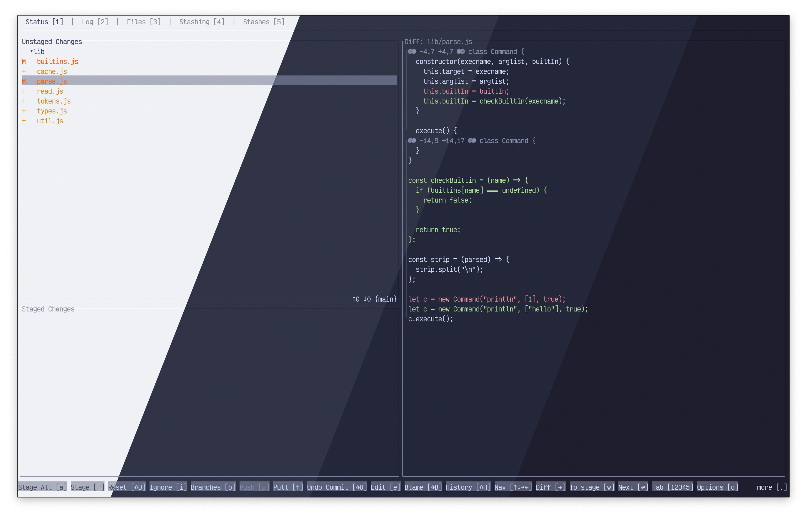
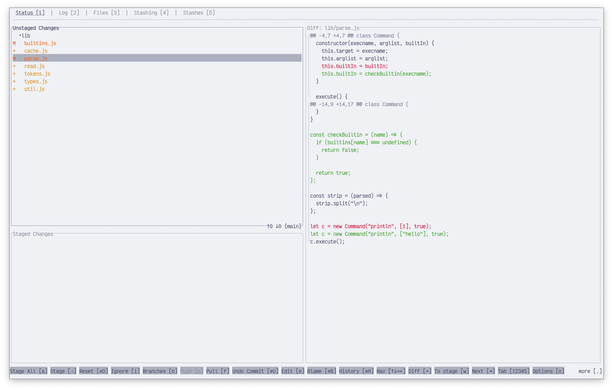
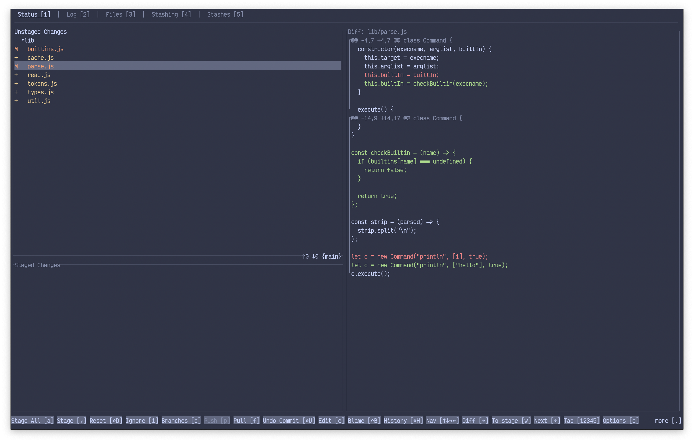
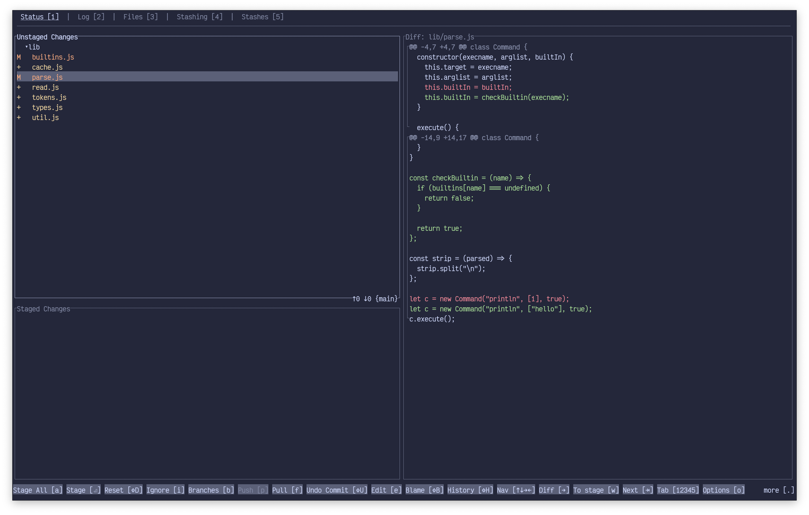
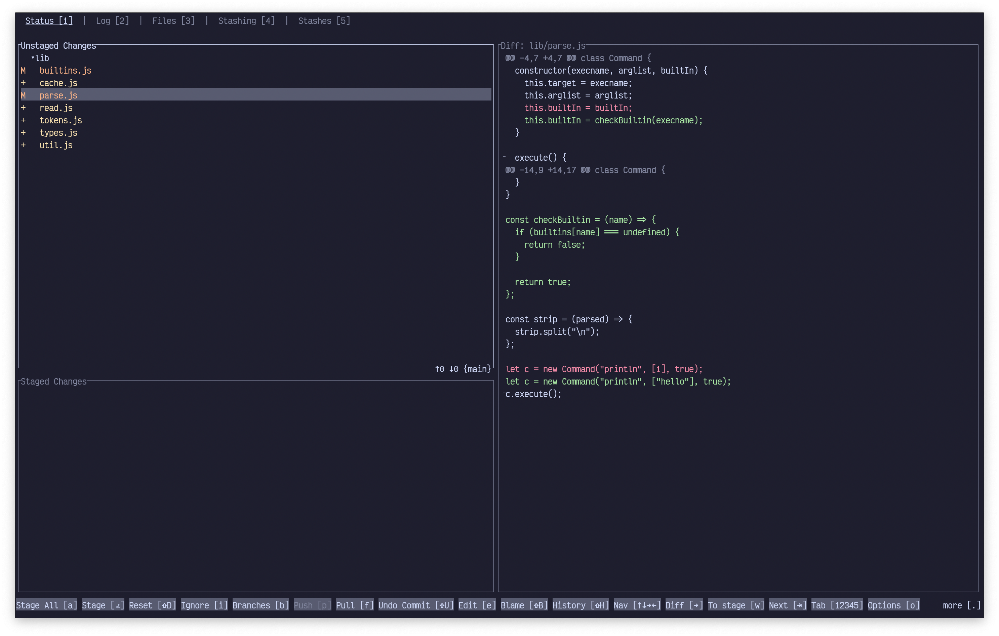

<h3 align="center">
	 
	
	Catppuccin for <a href="https://github.com/extrawurst/gitui">GitUI</a>
	
</h3>

	
	
	

	

## Previews

🌻 Latte

🪴 Frappé

🌺 Macchiato

🌿 Mocha

## Usage

> [!IMPORTANT]
> If you are using a version below `0.26.2`, view the instructions on the
> [`pre-0.26.2`](https://github.com/catppuccin/gitui/tree/pre-0.26.2) tag.

> [!TIP]
> This theme looks best paired with a matching Catppuccin theme for your terminal.

1. Copy the flavor(s) of your choice from [`theme/`](./theme/) to your [GitUI configuration directory](https://github.com/extrawurst/gitui/blob/master/THEMES.md) (typically `~/.config/gitui`).
2. You can either alias the `gitui` command to `gitui -t <flavor>.ron` (where `<flavor>` is mocha, macchiato, frappe, or latte) in your shell's configuration, or rename the flavor in the configuration directory to `theme.ron` (to load it as the default theme).

## 💝 Thanks to

- [BlueFalconHD](https://github.com/bluefalconhd)

&nbsp;

	

	Copyright &copy; 2021-present <a href="https://github.com/catppuccin" target="_blank">Catppuccin Org</a>

	

